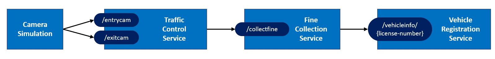

# 作业 1 - 运行应用程序

在本作业中，您将运行应用程序以确保一切正常工作。

## 作业目标

要完成此任务，您必须达到以下目标：

- 所有服务都在运行。
- 日志记录表明所有服务都在正常工作。

提醒一下，这就是服务之间的交互方式：

## 分步说明

要获取实现目标的分步说明，请打开分步说明：

- [.NET版本](step-by-step.md)
- [Java版本](step-by-step-java.md)
- [Python版本](step-by-step-python.md)

## 下一个任务

在继续下一个任务之前，请确保停止所有正在运行的进程并关闭 VS Code 中的所有终端窗口。

转到[作业 2](../Assignment02/README.md) 。
