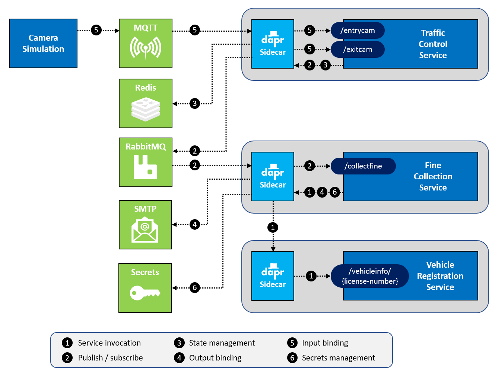

# 作业 2 - 添加 Dapr 服务到服务调用

## 作业目标

要完成此任务，您必须达到以下目标：

- VehicleRegistrationService 和 FineCollectionService 都使用 Dapr sidecar 运行。
- FineCollectionService 使用 Dapr 服务调用构建块来调用`/vehicleinfo/{licensenumber}`终端。

此作业是end-state设置中的**第 1 项：**




## 第 1 步：使用 Dapr 启动 VehicleRegistrationService

在作业 1 中，您使用`mvn spring-boot:run`启动了所有服务。当您想要使用用于通信的 Dapr sidecar 运行服务时，您需要使用 Dapr CLI 启动它。在启动服务时，您需要注意以下几点：

- 该服务需要一个唯一的 ID，Dapr 可以使用该ID来找到服务，我们把它称为*app-id* （或应用程序 ID）。您可以在命令行中输入`--app-id`

- 每个服务在不同的 HTTP 端口上侦听请求（以防止本地主机上的端口冲突）。例如， VehicleRegistrationService 在端口`6002`上运行。您需要告诉 Dapr 这个端口，以便 Dapr sidecar 可以与服务通信。您可以在命令行中使用`--app-port`

- 该服务可以使用 HTTP 或 gRPC 与 Dapr sidecar 进行通信。默认情况下，这些端口是`3500`和`50001` 。但是为了防止混淆，您将使用完全不同的端口号。为了在运行多个服务时防止本地机器上的端口冲突，您必须为每个服务指定唯一的 HTTP 和 gRPC 端口，可以在命令行中使用`--dapr-http-port`和`--dapr-grpc-port`。您将使用以下端口：

    服务 | 应用端口 | Dapr sidecar HTTP 端口 | Dapr sidecar gRPC 端口
    --- | --- | --- | ---
    TrafficControlService | 6000 | 3600 | 60000
    FineCollectionService | 6001 | 3601 | 60001
    VehicleRegistrationService | 6002 | 3602 | 60002

- 最后需要告诉 Dapr 如何启动服务。这些服务是 Java/Spring Boot 服务，可以使用命令`mvn spring-boot:run` 。

您将使用`run`命令并在命令行上指定上述所有选项：

1. 确保你已经在你的机器上启动了 Docker Desktop，并且安装了 Dapr CLI 和Dapr运行时（参见[先决条件](../README.md#prerequisites)）。

2. 在 VS Code 中打开源代码文件夹。

3. 在 VS Code 中打开终端窗口并确保当前文件夹是`VehicleRegistrationService` 。

4. 输入以下命令以运行带有 Dapr sidecar 的 VehicleRegistrationService：

    ```console
    dapr run --app-id vehicleregistrationservice --app-port 6002 --dapr-http-port 3602 --dapr-grpc-port 60002 mvn spring-boot:run
    ```

5. 检查日志是否有任何错误。如您所见，Dapr 和应用程序日志都都会输出。

现在您正在运行 VehicleRegistrationService 的“Daprized”版本，您可能已经注意到，您无需更改任何代码即可使其正常工作。 VehicleRegistrationService 仍然只是一个侦听请求的 Web API。直到现在，您才开始使用它的 Dapr sidecar，服务可以与之通信，这意味着其他服务可以使用 Dapr 来调用此服务，这也是您将在下一步中做的操作。

## 步骤 2：使用 Dapr 服务调用 调用 VehicleRegistrationService

在此步骤中，您将更改 FineCollectionService 的代码，使其使用 Dapr 服务调用来调用 VehicleRegistrationService。

首先，您将更改代码，使其调用 Dapr sidecar：

1. 在 VS Code 中打开文件`FineCollectionService/src/main/java/dapr/fines/vehicle/DefaultVehicleRegistrationClient.java`

2. 检查`getVehicleInfo`方法。它包含对 VehicleRegistrationService 的调用以获取车辆信息：

    ```java
    var params = Map.of("licenseNumber", licenseNumber);
    return restTemplate.getForObject(vehicleInformationAddress, VehicleInfo.class, params);
    ```

    `restTemplate`是 Spring 提供的用于调用 VehicleRegistrationService 的实用程序，用于使用该 REST Web 服务的基地址是通过该类的构造函数注入的，该构造函数是从 Spring 配置类调用的，后者又使用`@Value`读取 Spring 配置文件。

3. 在 VS Code 中打开`FineCollectionService/src/main/resources/application.yml`

    在这里，我们看到正在配置的实际值。检查`vehicle-information.address`设置。您可以看到在 HTTP 调用中，使用了 VehicleRegistrationService（在端口 6002 上运行）的 URL。

4. 在 Dapr sidecar 上调用 Dapr 服务调用构建块的 API 是：

    ```http
    http://localhost:<daprPort>/v1.0/invoke/<appId>/method/<method-name>
    ```

    您可以使用适当的值替换此 URL 中的占位符，以便 FineCollectionService 的 sidecar 可以调用 VehicleRegistrationService，这将生成以下 URL：

    ```http
    http://localhost:3601/v1.0/invoke/vehicleregistrationservice/method/vehicleinfo/{licenseNumber}
    ```

    正如在此 URL 中看到的，FineCollectionService 的 Dapr sidecar 将在 HTTP 端口`3601`上运行。

5. 将配置文件中的 URL 替换为新的 Dapr 服务调用 URL。该文件现在应如下所示：

    ```yml
    vehicle-information.address: http://localhost:3601/v1.0/invoke/vehicleregistrationservice/method/vehicleinfo/{licenseNumber}
    ```

    > 真正掌握 Dapr 使用的 sidecar 模式很重要。在这种情况下，FineCollectionService 通过**调用自己的 Dapr sidecar**来调用 VehicleRegistrationService！ FineCollectionService 不再需要知道 VehicleRegistrationService 所在的位置，因为它的 Dapr sidecar 会处理这些，它会根据`app-id`找到它并调用目标服务的 sidecar。

6. 在 VS Code 中打开一个**新的**终端窗口并确保当前文件夹是`FineCollectionService` 。

7. 通过构建代码检查所有代码更改是否正确：

    ```console
    mvn package
    ```

    如果您看到任何警告或错误，请查看前面的步骤以确保代码正确。

8. 输入以下命令以使用 Dapr sidecar 运行 FineCollectionService：

    ```console
    dapr run --app-id finecollectionservice --app-port 6001 --dapr-http-port 3601 --dapr-grpc-port 60001 mvn spring-boot:run
    ```

9. 检查日志是否有任何错误。如您所见，Dapr 和应用程序日志都都会输出。

现在您要测试应用程序：

1. 在 VS Code 中打开一个**新的**终端窗口并将当前文件夹更改为`TrafficControlService` 。

2. 输入以下命令以运行 TrafficControlService：

3. ```console
    mvn spring-boot:run
    ```

> 在此作业中，TrafficControlService 不需要与 Dapr sidecar 一起运行。这是因为它仍然会像以前一样通过 HTTP 调用 FineCollectionService。

服务已启动并正在运行。现在您将使用模拟来测试它。

1. 在 VS Code 中打开一个**新的**终端窗口并将当前文件夹更改为`Simulation` 。

2. 开始模拟：

    ```console
    mvn spring-boot:run
    ```

运行应用程序时，您应该会看到与之前类似的日志记录，所有功能都一样，但现在使用 Dapr 服务调用在 FineCollectionService 和 VehicleRegistrationService 之间进行通信。

## 第 3 步：使用 Dapr SDK for Java 调用 Dapr 服务

在此步骤中，更改 FineCollectionService 的代码，使其使用 Dapr SDK for Java 来调用 VehicleRegistrationService。 SDK 提供了一种更集成的方式来调用 Dapr sidecar API。

首先停止模拟：

1. 在 VS Code 中打开运行 Camera Simulation 的终端窗口。

2. `Ctrl-C`停止模拟，然后单击标题栏中的垃圾桶图标（或键入`exit`命令）关闭终端窗口。

3. 在 VS Code 中打开运行 FineCollectionService 的终端窗口。

4. `Ctrl-C`停止服务。保持此终端窗口打开并聚焦。

5. 在 FineCollectionService 目录下`pom.xml`中添加 Dapr SDK for Java 的依赖：

    ```xml
    <dependency>
        <groupId>io.dapr</groupId>
        <artifactId>dapr-sdk</artifactId>
    </dependency>
    ```

    依赖的版本是使用 Maven 的“依赖管理”来管理的——你可以检查`pom.xml`文件来查看确切的版本。

    > Dapr SDK for Java包含`DaprClient`类，用于直接调用 Dapr API 。还有一个与 Spring Boot 集成的附加库，但只有在构建使用 Dapr*提供服务的应用程序时，我们才需要它。*

现在您将更改代码以使用 Dapr 提供的`DaprClient`来调用 VehicleRegistrationService。在第 2 步中，我们使用了基于 Spring 的`RestTemplate`的现有代码，使我们的代码无需知道Dapr的存在。Dapr SDK for Java确保调用通过 Dapr sidecar 进行路由。

1. 创建一个新文件`FineCollectionService/src/main/java/dapr/fines/vehicle/DaprVehicleRegistrationClient.java`并在 VS Code 中打开它。

2. 声明一个类`DaprVehicleRegistrationClient`，实现`VehicleRegistrationClient`接口。确保包含包声明： `package dapr.fines.vehicle;` .为了履行`VehicleRegistrationClient`接口的契约，添加以下方法：

    ```java
    @Override
    public VehicleInfo getVehicleInfo(String licenseNumber) {
        return null;
    }
    ```

3. 在 VS Code 中打开文件`FineCollectionService/src/main/java/dapr/fines/FineCollectionConfiguration.java`。添加一个新方法来声明一个`DaprClient`类型的 Spring Bean：

    ```java
    @Bean
    public DaprClient daprClient() {
        return new DaprClientBuilder().build();
    }
    ```

    在同一个类中， `vehicleRegistrationClient`方法声明了一个 Spring Bean，它提供了`VehicleRegistrationClient`接口的实现。为此，它需要一个`DaprClient` bean。将此方法替换为以下内容：

    ```java
    @Bean
    public VehicleRegistrationClient vehicleRegistrationClient(final DaprClient daprClient) {
        return new DaprVehicleRegistrationClient(daprClient);
    }
    ```

    最后，更新类中的导入语句：

    ```java
    import dapr.fines.vehicle.DaprVehicleRegistrationClient;
    import io.dapr.client.DaprClient;
    import io.dapr.client.DaprClientBuilder;
    ```

4. 回到`DaprVehicleRegistrationClient`实现类并在此文件中添加 using 语句以确保您可以使用 Dapr 客户端：

    ```java
    import io.dapr.client.DaprClient;
    import io.dapr.client.domain.HttpExtension;

    import java.time.Duration;
    ```

    现在添加`DaprClient`类型的实例变量，并添加一个构造函数来注入它：

    ```java
    public class DaprVehicleRegistrationClient implements VehicleRegistrationClient {
        private final DaprClient daprClient;

        public DaprVehicleRegistrationClient(final DaprClient daprClient) {
           this.daprClient = daprClient;
        }
    ```

    最后，更新`getVehicleInfo()`方法的实现以使用`DaprClient` ：

    ```java
    var result = daprClient.invokeMethod(
             "vehicleregistrationservice",
             "vehicleinfo/" + licenseNumber,
             null,
             HttpExtension.GET,
             VehicleInfo.class
    );

    return result.block(Duration.ofMillis(1000));
    ```

    正如你在这段代码中看到的，这段代码不需要应用程序知道*车辆登记服务的地址*，只需要它的*名称*。每次调用`DaprClient` ，都可以指定要与之通信的服务`app-id`

    > 另请注意， `DaprClient` `invokeMethod`方法返回`Mono` 。因为我们不想被响应式编程带来的所有可能性分心，所以我们立即调用`block`来等待结果。在实际场景中，通过应用程序传播 Mono 以使其更具响应会更有意义。

    > 此时，您可以从`application.yml`文件中移除`vehicle-information.address`，Dapr SDK for Java不需要它。

现在将 FineCollectionService 更改为使用 Dapr SDK 进行服务调用，让我们测试一下。

1. 如果您按照此作业中的说明进行操作，则 VehicleRegistrationService 和 TrafficControlService 仍在运行。

2. 在运行 FineCollectionService 的 VS Code 中打开终端窗口。

3. 输入以下命令再次启动更改后的 FineCollectionService：

    ```console
    dapr run --app-id finecollectionservice --app-port 6001 --dapr-http-port 3601 --dapr-grpc-port 60001 mvn spring-boot:run
    ```

服务已启动并正在运行。现在您将使用模拟来测试它。

1. 在 VS Code 中打开一个**新的**终端窗口并将当前文件夹更改为`Simulation` 。

2. 开始模拟：

    ```console
    mvn spring-boot:run
    ```

运行应用程序时，您应该会看到与之前类似的日志记录。

## 第 4 步：使用 Dapr 可观察性

那么如何检查对 VehicleRegistrationService 的调用是否由 Dapr 处理呢？Dapr 内置了一些可观察性，您可以使用 Zipkin 查看 Dapr 流量：

1. 打开浏览器并访问此 URL： [http://localhost:9411/zipkin](http://localhost:9411/zipkin) 。

2. 单击屏幕右上角的`RUN QUERY`按钮以搜索跟踪。

3. 您应该会看到 FineCollectionService 和 VehicleRegistrationService 之间的调用，可以展开和折叠每条跟踪，然后单击“ `SHOW`按钮以获取更多详细信息：

    

4. 如果单击dependencies按钮并搜索，您将看到服务和它们之间的流量：

    

## 下一个任务

在继续下一个任务之前，请确保停止所有正在运行的进程并关闭 VS Code 中的所有终端窗口。

跳到[作业 3](../Assignment03/README.md) 。
